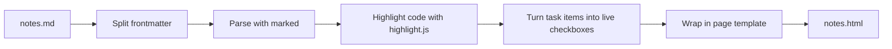

# How md-press works

md-press is small on purpose. This page explains its shape so changes keep it that way.

## Principle

The Markdown file is the source of truth. md-press only gives it a better view. It never needs an account, a server, or an AI model, and the same input always produces the same page (apart from the build date in the footer).

## Layout

```
bin/md-press.js          Command line: reads arguments, calls the builder
src/build.js             Builder: Markdown text in, one HTML page out
src/template/page.css    The page's look, inlined into every page
src/template/checklist.js  Checklist behavior, inlined only when a page has tasks
test/                    Tests, run with Node's built-in test runner
examples/showcase.md     One page that uses every feature
```

The command line stays thin. Anything worth testing lives in `src/build.js`, which exports plain functions.

## Build pipeline



1. **Frontmatter.** A simple `key: value` block at the top. Only `title` and `description` are used.
2. **Parsing.** [marked](https://marked.js.org) turns Markdown into HTML, with GitHub-flavored extras like tables and task lists.
3. **Code.** Fenced code with a known language is highlighted at build time. Unknown languages are escaped as plain text. `mermaid` fences are kept as diagram source.
4. **Checklists.** marked renders task items as disabled checkboxes. md-press swaps them for live ones and counts them.
5. **Template.** The page gets its title, the inlined stylesheet, and, only when needed, the checklist script and the Mermaid loader.

## Checklist storage

Each checkbox is keyed by its label text, plus a counter for duplicate labels. Reordering or adding items in the file does not scramble saved progress. Renaming an item resets that one item. Progress is stored in the browser under `md-press:<file name>`, so two files with the same name in different folders share progress. That is a known limit of the current design.

## Dependencies

| Package | Why |
| --- | --- |
| marked | Markdown parsing, fast and well maintained |
| highlight.js | Build-time code highlighting |

New runtime dependencies need a strong reason. Development tools (ESLint) do not ship to users.

## Design decisions

- **Inline everything.** A page that depends on nothing breaks for no one.
- **Mermaid from a CDN.** Bundling it would add megabytes to every install for a feature most pages never use. It loads only on pages with a diagram and fails quietly offline.
- **CommonJS, no build step.** The source you read is the code that runs.
