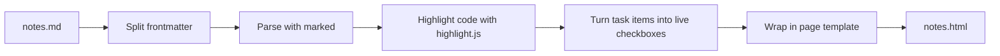
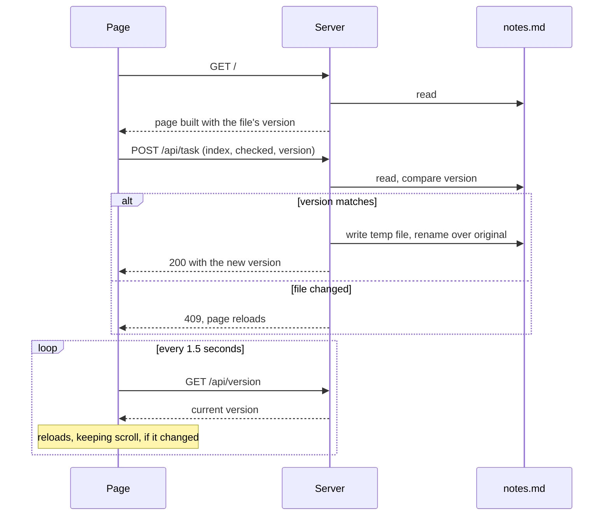

# How md-press works

md-press is small on purpose. This page explains its shape so changes keep it that way. For why things are the way they are, see [Decisions](decisions.md).

## Principle

The Markdown file is the source of truth. md-press only gives it a better view. It never needs an account, a hosted service, or an AI model, and the same input always produces the same page (apart from the date in the footer).

## Layout

```
bin/md-press.js            Command line: reads arguments, runs build or serve
src/build.js               Builder: Markdown text in, one HTML page out
src/serve.js               Local server for md-press serve
src/tasks.js               Finds task lines in the source and flips one checkbox
src/frontmatter.js         Reads the frontmatter block, shared by builder and scanner
src/template/page.css      The page's look, inlined into every page
src/template/page.js       Checklist and live behavior, inlined only when needed
test/                      Tests, run with Node's built-in test runner
examples/showcase.md       One page that uses every feature
docs/                      Architecture, decisions, roadmap
```

The command line stays thin. Anything worth testing lives in `src/` as plain functions.

## Build



1. **Frontmatter.** A simple `key: value` block at the top. Only `title` and `description` are used.
2. **Parsing.** [marked](https://marked.js.org) turns Markdown into HTML, with GitHub-flavored extras like tables and task lists. Raw HTML is kept, as the Markdown spec says.
3. **Code.** Fenced code with a known language is highlighted at build time. Unknown languages are escaped as plain text. `mermaid` fences are kept as diagram source.
4. **Checklists.** marked renders task items as disabled checkboxes. md-press swaps them for live ones and counts them.
5. **Template.** The page gets its title, the inlined stylesheet, and, only when needed, the page script and the Mermaid loader. Settings for the script are inlined as JSON with `<` escaped, so nothing in a file name can end the script early.

## Serve



- **Version.** The first 16 hex characters of the file's SHA-256 hash. It changes whenever any byte changes.
- **Mapping a checkbox to a line.** `src/tasks.js` scans the source line by line in document order, skipping frontmatter and fenced code, and records every line that starts a task item. The page's Nth checkbox is the scanner's Nth task. The page is writable only when both counts match. Otherwise it opens read-only.
- **Writing.** Only the character between the brackets changes. The new file goes to a temporary dotfile in the same folder, then is renamed over the original, which is atomic. Reading, checking, and writing are synchronous with no pause in between, so two saves cannot interleave.
- **What the server answers.** Only requests whose Host is `localhost` or `127.0.0.1`. `/` renders the page, `/api/version` and `/api/task` handle live updates, and any other GET serves a file from the Markdown file's folder, never a dotfile and never outside that folder.

## Storage on built pages

Each checkbox is keyed by its label text, plus a counter for duplicate labels, so reordering or adding items in the file does not scramble saved progress. Renaming an item resets that one item. Progress is stored in the browser under `md-press:<file name>`, so two files with the same name in different folders share progress. That is a known limit.

## Dependencies

| Package | Why |
| --- | --- |
| marked | Markdown parsing, fast and well maintained |
| highlight.js | Build-time code highlighting |

The server uses only Node's built-in modules. New runtime dependencies need a strong reason. Development tools (ESLint) do not ship to users.
