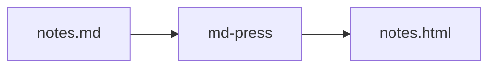

# This heading should NOT be the title

The browser tab should say **md-press showcase** (from frontmatter), not the heading above.

## Text basics

Plain paragraph with **bold**, *italic*, ***both***, ~~strikethrough~~, `inline code`, and a [link to sirux.io](https://sirux.io).

Special characters should show as text, not break the page: <div>, &amp;, "quotes", 'apostrophes', and 5 < 10 > 2.

> A blockquote. It should have a teal bar on the left
> and wrap across lines cleanly.

---

## Lists

- Unordered item
- Another item
  - Nested item
  - Nested item two
- Back to top level

1. First step
2. Second step
3. Third step

## Checklist (test these)

Check a few boxes, reload the page, and they should stay checked. The progress bar at the top should update.

- [x] Starts checked
- [ ] Starts unchecked
- [ ] Item with **bold** and `code` inside
- [ ] Duplicate label
- [ ] Duplicate label
- [ ] Reset should restore the first box as checked and the rest unchecked

## Code

```js
/*
Greets a person by name.
*/
function greetPerson(personName) {
  const greeting = `Hello, ${personName}`;
  return greeting;
}
```

```python
def count_words(text):
    return len(text.split())
```

```bash
md-press notes.md --out pages
```

```
No language tag here, so no label and no highlighting.
```

```madeuplanguage
Unknown language should fall back to plain text without crashing.
```

## Table

| Check | Where | Status |
| --- | --- | --- |
| Dark mode | Switch your system theme | Should flip colors |
| Print | Cmd+P | Progress bar hidden |
| Mobile | Narrow the window | No sideways page scroll |

### Wide table (should scroll inside itself, not the page)

| Column one | Column two | Column three | Column four | Column five | Column six | Column seven | Column eight |
| --- | --- | --- | --- | --- | --- | --- | --- |
| a long cell value | another long value | more text here | keeps going | still going | almost there | nearly done | the end |

## Diagram

This is the only part that needs internet. Offline, it shows the raw source instead.



## Headings all the way down

### Level three
#### Level four
##### Level five
###### Level six

That's everything. If this page looks right, md-press works.
